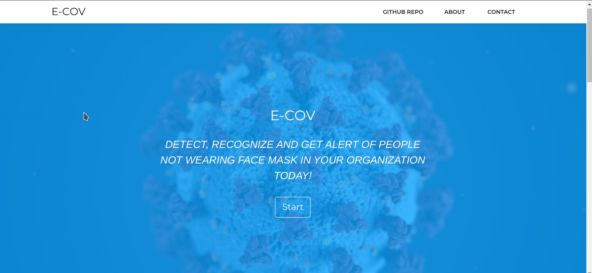

# E-COV

E-COV is a desktop app that detects face, face mask, and alerts authorities of people not wearing face mask on prohibited areas. It uses a deep learning model to build the face and face mask detection, and a face recognition library to recognize people not wearing a face mask. It is built to slow down the spread of the Corona pandemic.

<!--  -->

**version 1.0.0**

## Getting Started

These instructions will get you a copy of the project up and running on your local machine for development and testing purposes.

## Prerequisites (Linux)

- Python

```bash
sudo add-apt-repository ppa:jonathonf/python-3.7
sudo apt-get update
sudo apt-get install python3.7
```

- pip3

```bash
sudo apt update
sudo apt install python3-pip
```

- Pyinstaller

```bash
pip3 install pyinstaller
```

## Installing

### For Development

1. Clone the Repo
   ```bash
    git clone https://github.com/jedisam/E-COV.git
   ```
1. cd into repo
   ```bash
   cd E-COV
   ```
1. Install Requirements
   ```bash
    pip3 install requirements.txt
   ```
1. Run the App
   ```bash
    flask run
   ```

### To Package & Build

1. Build the Python app using pyinstaller (This might take some time).
   ```bash
    pyinstaller main.py
   ```
   Go into dist director and run the app
   ```bash
   cd dist/
   ./main
   ```
1. cd into Electron folder and install dependencies
   ```bash
    cd ../Electron && npm install
   ```
   For Linux
   ```bash
   npm run package-linux
   ```
   For Windows
   ```bash
   npm run package-win
   ```
   For Mac
   ```bash
   npm run package-mac
   ```
1. Run the Desktop app
   Get into the build directory (for linux)
   ```bash
   cd e-cov-linux-x64
   ./e-cov
   ```

## Tools and Technologies used

- Deep learning
- Flask
- Pyinstaller
- Electron
- Node.Js (Email)
- Docker
- HTML, CSS
- Azure(Machine Learning Studio)

## Authors

- **Yididya Samuel** [Website](jedisam.github.io)
